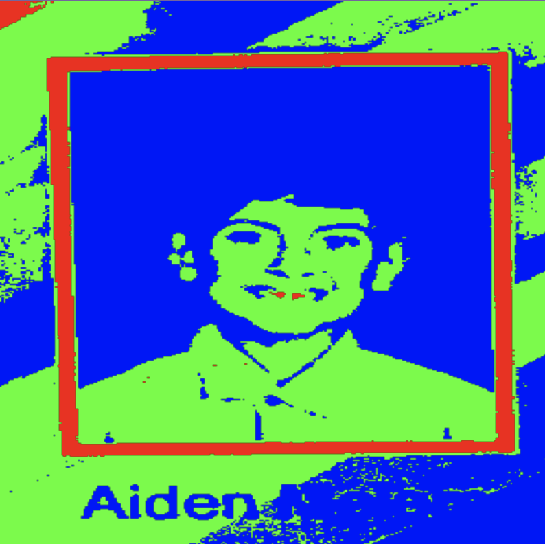
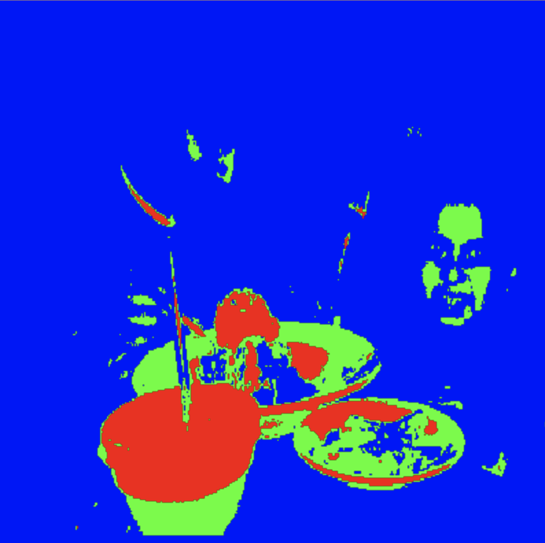
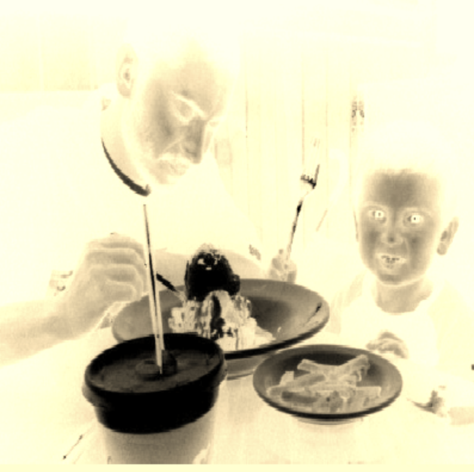
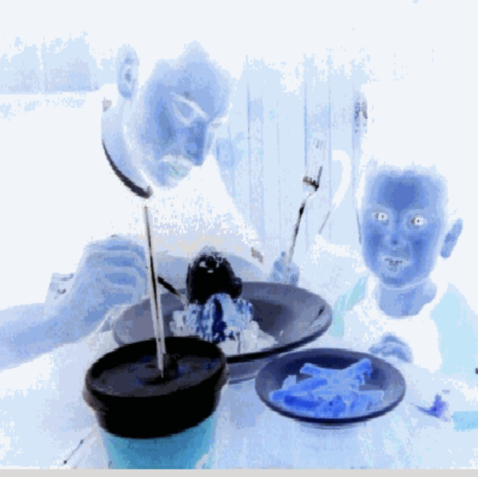

# Personal-Narrative-
Personal Narrative project for p2 comp sci

## Introduction
Images are often used to portray our personal experiences and interests. We also use image filters and effects to change or enhance the mood of an image. When combined into collages and presentations, these images tell a story about who we are and what is important to us. Your goal is to create an animation using The Theater and Scene API that consists of images of your personal experiences and/or interests. In this animation, you will incorporate data related to these experiences and/or interests that can be organized in a 2D array, and use image filters and effects to change or enhance the mood of your images.

## Requirements

Use your knowledge of object-oriented programming, two-dimensional (2D) arrays, and algorithms to create your personal narrative collage or animation:

    Write Scene subclasses – Create two Scene subclasses: either two core parts of your personal life, or two components of a personal interest. Each class must contain a constructor and private instance variable with data related to the scene
    Create at least two 2D arrays – Create at least two 2D arrays to store the data that will make up your visualization.
    Implement algorithms – Implement one or more algorithms that use loops and logic that operate on the data in your 2D arrays.
    Create a visualization – Create an animation that conveys the story of the data by illustrating the patterns or relationships in the data.
    Image Filters – Utilize the image filters created in this unit (and possible new filters) that show a personal flare to the images used in your animation.
    Document your code – Use comments to explain the purpose of the methods and code segments and note any preconditions and postconditions.Create at least two 2D arrays – Create at least two 2D arrays to store the data that will make up your visualization.

## Link to Code.org

https://studio.code.org/projects/javalab/077a2d8b-3b14-4c53-a96e-5c70d543252e

## Image examples of filters
Sharpen example, when bringing the colors to their highest values betwen 0-225

Colorize example shifting into their green blue and red values

Sepia sets the colors to colors ranging from white, grey, and to black

Negative images sets the colors to a colder hue, whilst swaping where the areas of lighting and shadows appear

## Some of the major code
Here is the code that would print the images and call each filter

[SceneTwo](SceneTwo.java)

Here is the code in which defines the code
[ImageFilter](ImageFilter.java)